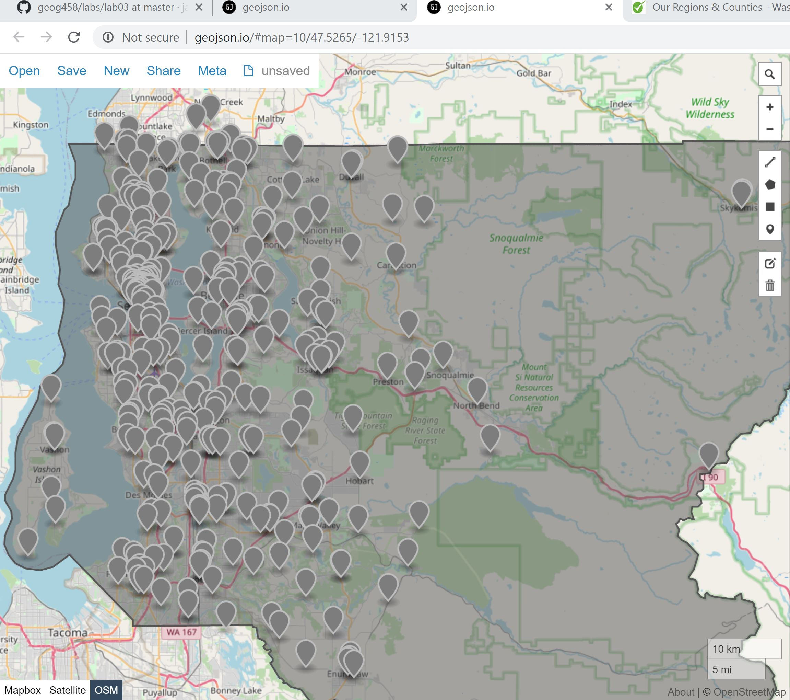

# Emergency Services in King County

Caption: I am using this image screenshot from my 4 geojson files loaded in geojson.io because I could not determine a way to load my geojson files from my computer into my web page.

<h4> Project Description </h4>

This project is supposed to be a site for people from King County to be able to see all the emergency services that are in their area and they have access to. The site would give information on how to contact and the address for each individual location.

<h4>Project Goal</h4>

The goal was to have the information for all of the main emergency services in King County avaiable in one space for people to search. The orginal plane was to code the point layers of the three different services, so there could be one layer at a time visiable. So, if people were only searching for one type of service they could focus on that layer, but to work around that I colored the three point layers differently so they were easy to distinguish, which points were for which service. 

<h4>Data Sources</h4>

[King County Open Data](https://data.kingcounty.gov/)

[Leaflet-providers preview](https://leaflet-extras.github.io/leaflet-providers/preview/)

<h4>Applied Libraries</h4>

leaflet
Javascript
html
Atom
GitHub
QGIS
geoJson

<h4>Acknowledgement</h4>

I would not have been able to create this map without the data provided by King County on their open data portal.

Professor Zhao for teaching this quarter and furthering my skills in web map design and coding.

<h4>Extra Information</h4>
For people viewing this the map is not able to be seen the code did not work out correctly and I have personally struggled with motivating myself with doing this project with the current events that occuring now. I am sorry for the lack of deliverables.
